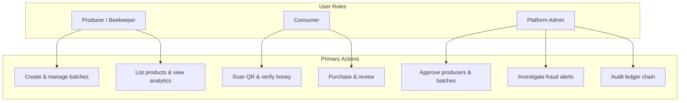

# 1. Project Overview

## 1.1 Background

Honey adulteration and mislabelling are persistent problems in global food supply chains. Consumers often cannot verify origin claims, harvest dates, or producer identity. Small-scale beekeepers lack affordable tools to prove authenticity and build trust with buyers.

HiveTrace addresses this gap by providing a web-based traceability platform where honey batches are cryptographically sealed, administratively verified, registered on an immutable ledger, and made discoverable through QR codes and a consumer-facing marketplace.

## 1.2 Problem Statement

Traditional honey labelling relies on trust in packaging text alone. Counterfeit QR codes, relabelled bulk honey, and geographic misrepresentation are difficult to detect without:

- A tamper-evident record of batch metadata at creation time
- An independent verification step before batches enter the public trust network
- Scan telemetry that reveals suspicious usage patterns
- A feedback mechanism tied to verified purchases rather than anonymous ratings

## 1.3 Project Objectives

| Objective | Implementation |
|-----------|----------------|
| Ensure batch data integrity | HMAC-SHA256 verification hashes (`lib/crypto.ts`) |
| Provide auditability | Hash-chained ledger blocks (`lib/blockchain.ts`) |
| Detect fraudulent scan behaviour | Rule-based fraud engine (`lib/actions/scan-actions.ts`) |
| Enable producer–consumer commerce | Product catalog, cart, Paystack checkout |
| Build producer reputation | Verified reviews linked to paid orders |
| Support multi-role access | Consumer, Producer, and Admin portals |

## 1.4 Scope

### In Scope (Implemented)

- User registration and role-based login (Consumer, Producer, Admin)
- Producer batch lifecycle: create → pending → admin approve → ledger register → QR issue
- Public batch verification via `/verify/[hash]` and consumer QR scanner
- Admin dashboard: producer approval, batch verification, fraud alerts, ledger viewer, contact messages
- E-commerce: shop, checkout, Paystack payment, order history, payment retry
- Reviews with verified-purchase badge
- Fraud alert investigation workflow

### Out of Scope (Final-Year Demo Context)

- Full production deployment (PostgreSQL on cloud, email notifications, CDN)
- Mobile native applications
- IoT hive sensors
- Public blockchain network (Ethereum, etc.) — replaced by application-level hash chain
- Automated image upload to object storage (URLs are accepted; blob storage is optional)

## 1.5 Stakeholders and User Roles

### Producer

Registers a business profile, submits honey batches for verification, lists products linked to verified batches, and monitors scan counts, orders, and reviews.

### Consumer

Scans QR codes to verify authenticity, browses the shop, completes purchases, and submits reviews (marked verified when tied to a paid order).

### Admin

Vets new producers, performs quality review on batches, registers approved batches on the ledger, manages fraud alerts, and views platform-wide statistics.

## 1.6 Success Criteria

For demonstration and academic evaluation, the system is considered successful when:

1. A producer-created batch cannot pass verification if its metadata is altered after hash generation.
2. Admin approval produces a ledger block whose hash chain validates end-to-end.
3. Simulated suspicious scans (e.g., rapid burst or cross-country pattern) generate fraud alerts.
4. A consumer can complete a Paystack test payment and receive order confirmation with stock decremented only after payment verification.
5. Reviews from paying customers display a verified badge and update producer aggregate ratings.

## 1.7 Related Documents

- [System Architecture](./02-system-architecture.md) — How components connect
- [Development Methodology](./03-development-methodology.md) — How the system was built
- [Testing & Demonstration](./13-testing-demonstration.md) — How to evaluate the system
