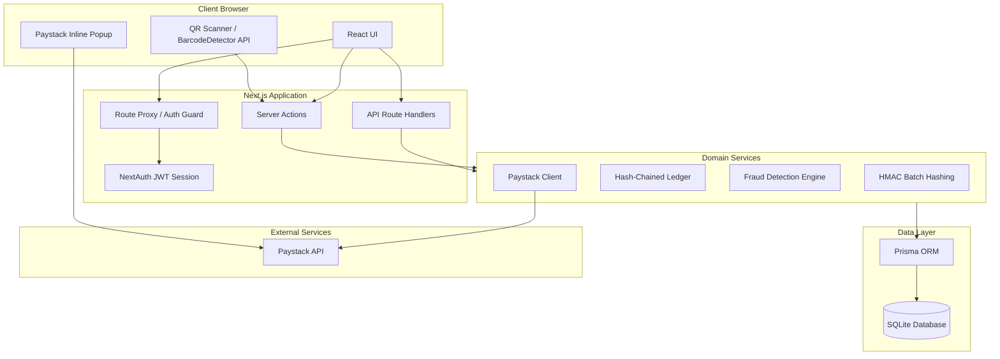
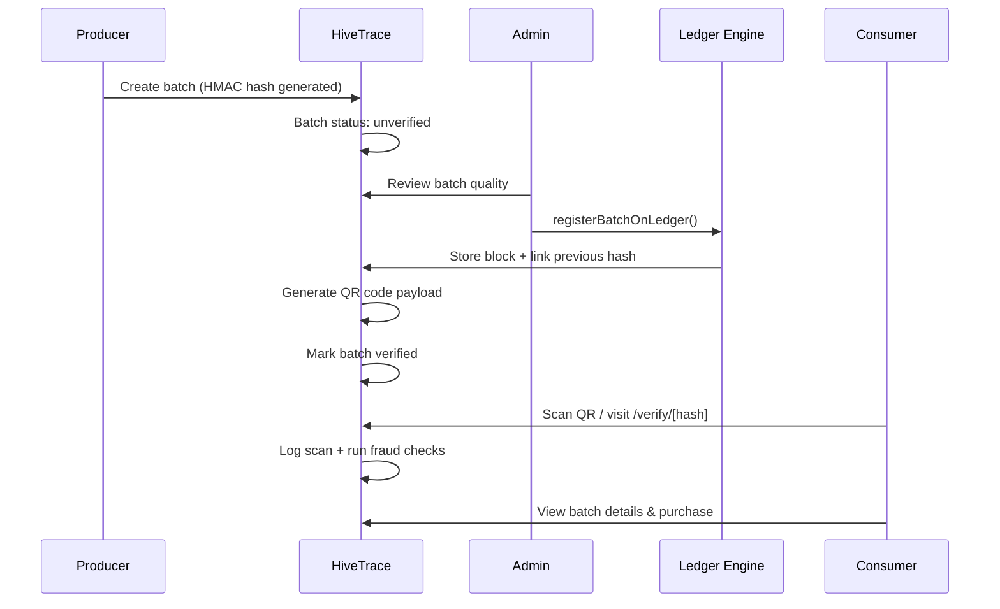
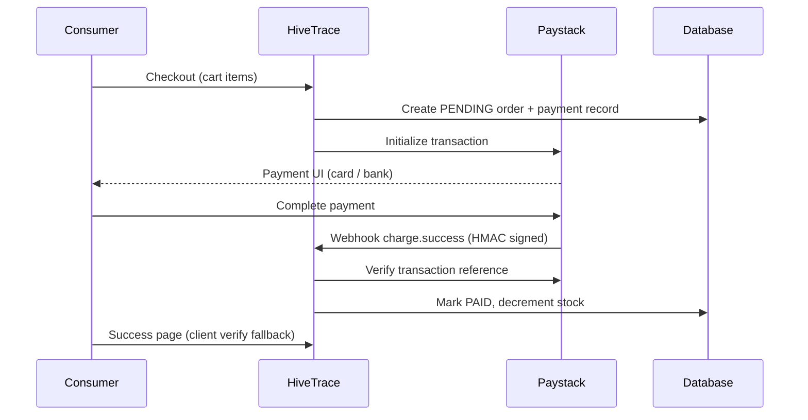

# 2. System Architecture

## 2.1 Architectural Style

HiveTrace follows a **monolithic full-stack web application** pattern built on **Next.js App Router**. The architecture separates concerns into:

- **Presentation layer** — React Server and Client Components (`app/`, `components/`)
- **Application layer** — Server Actions and Route Handlers (`lib/actions/`, `app/api/`)
- **Domain layer** — Business logic modules (`lib/blockchain.ts`, `lib/crypto.ts`, `lib/paystack-server.ts`)
- **Data layer** — Prisma ORM with SQLite (local development)

This is a pragmatic choice for a final-year project: a single deployable unit with clear module boundaries, without the operational overhead of microservices.

## 2.2 High-Level Architecture Diagram



## 2.3 Request Flow Patterns

### Server Components (Read-Heavy Pages)

Dashboard and admin pages fetch data directly in React Server Components by calling Server Actions or Prisma. This reduces client-side JavaScript and keeps database credentials server-side.

Example pages: `/dashboard`, `/admin`, `/consumer/batch/[id]`

### Server Actions (Mutations)

Form submissions and interactive workflows use Next.js Server Actions marked with `'use server'`. These functions validate the session, perform database operations, and call `revalidatePath()` to refresh cached pages.

Example: `verifyAndApproveBatch`, `submitBatchReview`, `registerScan`

### API Routes (External / Client Integration)

REST endpoints under `app/api/` serve:

- Paystack webhooks (requires raw body for HMAC signature verification)
- QR verification from client scanner components
- Public blockchain verification lookups

## 2.4 Batch Lifecycle Flow



## 2.5 Payment Flow



Stock is intentionally **not** decremented at cart time. Inventory changes occur only after Paystack verification succeeds, preventing overselling on abandoned checkouts.

## 2.6 Directory Structure

```
HiveTrace/
├── app/                    # Next.js App Router pages and API routes
│   ├── admin/              # Admin portal
│   ├── dashboard/          # Producer portal
│   ├── consumer/           # Consumer features (scanner, orders, profiles)
│   ├── shop/               # Public marketplace
│   ├── checkout/           # Payment flow
│   ├── verify/[hash]/      # Public batch verification page
│   └── api/                # REST endpoints
├── components/             # Reusable UI (shadcn/ui based)
├── lib/
│   ├── actions/            # Server Actions by domain
│   ├── auth.ts             # NextAuth configuration
│   ├── blockchain.ts       # Ledger engine
│   ├── crypto.ts           # HMAC hashing & geo utilities
│   ├── paystack-server.ts  # Paystack server SDK
│   └── prisma.ts           # Database client singleton
├── prisma/
│   ├── schema.prisma       # Data model
│   └── seed.ts             # Demo data seeder
├── proxy.ts                # Auth middleware for protected routes
└── docs/                   # This documentation
```

## 2.7 Cross-Cutting Concerns

| Concern | Mechanism |
|---------|-----------|
| Authentication | NextAuth.js with JWT sessions and Credentials provider |
| Authorization | Role checks in Server Actions + `proxy.ts` route guards |
| Configuration | `lib/config.ts` feature flags and fraud thresholds |
| Cache invalidation | `revalidatePath()` after mutations |
| Type safety | TypeScript across frontend and backend |

## 2.8 Design Trade-offs

| Decision | Rationale | Trade-off |
|----------|-----------|-----------|
| SQLite for local demo | Zero-config setup for evaluators | Not suitable for concurrent production writes |
| Application-level ledger vs public blockchain | No gas fees, instant writes, full control | Centralized trust model (admin-operated) |
| Server Actions vs REST-only | Simpler forms, less boilerplate | Harder to expose as standalone public API |
| JWT sessions | Stateless auth scaling | Cannot revoke individual sessions without blocklist |

## 2.9 Related Documents

- [Technology Stack](./04-technology-stack.md)
- [Cryptographic Verification](./05-cryptographic-verification.md)
- [Blockchain Ledger](./06-blockchain-ledger.md)
- [Authentication & Authorization](./08-authentication-authorization.md)
