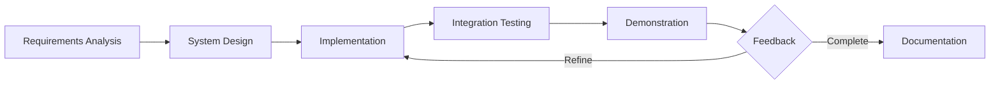

# 3. Development Methodology

## 3.1 Approach Overview

HiveTrace was developed using an **iterative Agile-inspired methodology** adapted for a single-developer final-year project. Work was organized into vertical slices (features end-to-end) rather than horizontal layers (all UI first, then all backend).

This approach ensured each increment produced a demonstrable outcome suitable for supervisor review and viva presentation.

## 3.2 Software Development Life Cycle (SDLC)



### Phase 1: Requirements Analysis

- Identified honey traceability pain points (adulteration, fake labels, lack of consumer trust)
- Defined three actor roles: Producer, Consumer, Admin
- Prioritized novel contributions: cryptographic verification, fraud detection, immutable audit trail

### Phase 2: System Design

- Selected Next.js full-stack architecture for rapid development
- Designed Prisma schema covering traceability, commerce, and audit entities
- Specified hash-chained ledger as a lightweight alternative to public blockchain

### Phase 3: Iterative Implementation

Development proceeded in functional increments:

| Iteration | Deliverable |
|-----------|-------------|
| 1 | Auth, roles, producer registration, basic dashboard |
| 2 | Batch creation, HMAC hashing, QR generation |
| 3 | Admin approval workflow, ledger registration |
| 4 | Consumer scanner, verification pages, scan logging |
| 5 | Fraud detection rules and admin alert panel |
| 6 | E-commerce catalog, Paystack checkout, order management |
| 7 | Reviews, producer ratings, analytics, settings |
| 8 | Integration hardening, seed data, documentation |

### Phase 4: Integration & Validation

- End-to-end flows tested manually: batch create → approve → scan → purchase → review
- Production build verification (`pnpm build`)
- Database seed script for repeatable demo environment

## 3.3 Design Methodologies Applied

### Domain-Driven Module Boundaries

Business logic is grouped by domain rather than technical layer:

- `lib/blockchain.ts` — Ledger concerns only
- `lib/crypto.ts` — Cryptographic primitives only
- `lib/actions/scan-actions.ts` — Scan telemetry and fraud rules
- `lib/actions/order-actions.ts` — Order and payment orchestration

This keeps each module testable and explainable in isolation during academic defence.

### Security-by-Design

Security considerations were embedded early:

1. Batch hashes use server-side secrets (`BATCH_HASH_SECRET`), never exposed to clients
2. Batches require admin verification before public trust status
3. Payment fulfillment requires Paystack server-side verification + webhook HMAC
4. API routes enforce session and role checks
5. Paystack webhook validates `x-paystack-signature` before processing

### Feature Flag Configuration

Configurable behaviour in `lib/config.ts` allows demonstration toggles without code changes:

```typescript
features: {
  fraudDetection: process.env.NEXT_PUBLIC_ENABLE_FRAUD_DETECTION === 'true',
  geoVerification: process.env.NEXT_PUBLIC_ENABLE_GEO_VERIFICATION === 'true',
  reviews: process.env.NEXT_PUBLIC_ENABLE_REVIEWS === 'true',
}
```

## 3.4 Data Modelling Methodology

The database schema follows **relational normalisation** with Prisma:

- **One-to-one**: User ↔ Producer, Batch ↔ Product, Order ↔ Payment
- **One-to-many**: Producer → Batches, Batch → QRScans, Order → OrderItems
- **Aggregate**: ProducerRating denormalises review statistics for fast reads

The `LedgerBlock` model is append-only by convention: blocks are created, never updated or deleted, preserving audit integrity.

## 3.5 UI/UX Methodology

The interface uses **role-specific portals** with shared design language (Tailwind CSS + shadcn/ui):

- Consistent navigation sidebars per role
- Progressive disclosure: public verification pages show essential trust signals first
- Mobile-friendly QR scanner with BarcodeDetector API fallback to manual entry

## 3.6 Testing Strategy

Given project scope, testing emphasises:

| Type | Method |
|------|--------|
| Functional | Manual scenario walkthroughs (see [Testing Guide](./13-testing-demonstration.md)) |
| Integration | Paystack test mode transactions |
| Integrity | Ledger chain verification via `/api/blockchain/verify` |
| Build | TypeScript compile + Next.js production build |

Automated unit/integration test suites were deprioritised in favour of demonstrable end-to-end flows suitable for viva evaluation.

## 3.7 Version Control & Collaboration

- Git for source control with feature-focused commits
- Environment secrets isolated in `.env` (not committed)
- `.env.example` documents required variables without sensitive values

## 3.8 Limitations Acknowledged

For academic honesty, the following limitations are documented:

1. **Centralised ledger** — Trust anchor is the platform operator, not a decentralised network
2. **Geo-fraud heuristics** — IP-based geolocation is approximate; GPS requires user consent
3. **Simulated quality scan** — Admin batch approval may include simulated lab metrics in UI
4. **SQLite concurrency** — Adequate for demo, not for high-traffic production

## 3.9 Related Documents

- [Project Overview](./01-project-overview.md)
- [System Architecture](./02-system-architecture.md)
- [Testing & Demonstration](./13-testing-demonstration.md)
