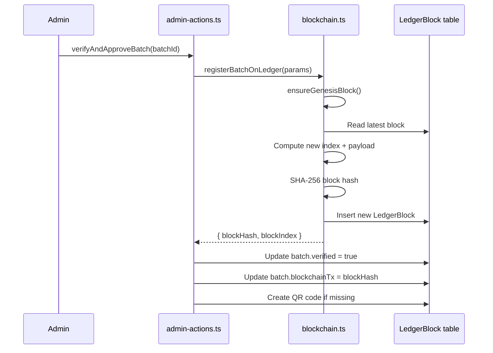

# 6. Blockchain Ledger

## 6.1 Concept

HiveTrace implements a **hash-chained append-only ledger** inspired by blockchain data structures, without connecting to a public blockchain network (Ethereum, Bitcoin, etc.).

Each ledger block:

1. Contains a canonical JSON payload describing an event
2. References the previous block's hash
3. Has its own hash computed from index, previous hash, payload, timestamp, and nonce

Tampering with any historical block breaks the chain — detectable via `verifyLedgerIntegrity()`.

### Why Not a Public Blockchain?

| Factor | Application Ledger | Public Blockchain |
|--------|-------------------|-------------------|
| Cost | Free (local DB writes) | Gas fees per transaction |
| Speed | Instant | Block confirmation delays |
| Complexity | Single codebase | Wallet, smart contracts, network |
| Trust model | Platform-operated | Decentralised consensus |
| Final-year scope | Demonstrates concept | Operational overhead |

The ledger provides **tamper-evident auditability** suitable for academic demonstration while acknowledging centralised trust in the platform operator.

## 6.2 Block Types

| Type | Purpose | Created When |
|------|---------|--------------|
| `GENESIS` | Chain origin marker | First ledger operation (`ensureGenesisBlock`) |
| `BATCH_VERIFY` | Admin-approved batch record | `verifyAndApproveBatch()` |
| `FRAUD_RECORD` | Fraud alert immutably logged | `registerFraudOnLedger()` (available, optional use) |

## 6.3 Block Structure

Database model: `LedgerBlock` in `prisma/schema.prisma`

| Field | Description |
|-------|-------------|
| `index` | Sequential block number (0 = genesis) |
| `blockHash` | SHA-256 hash of this block's contents |
| `previousHash` | Hash of preceding block (genesis uses 64 zeros) |
| `batchId` | Optional link to HoneyBatch |
| `blockType` | GENESIS, BATCH_VERIFY, or FRAUD_RECORD |
| `payload` | Canonical JSON string sealed in block |
| `nonce` | Reserved for proof-of-work extension (currently 0) |
| `createdBy` | Admin user ID who triggered the block |

## 6.4 Hash Computation

Source: `lib/blockchain.ts`

```typescript
function computeBlockHash(
  index: number,
  previousHash: string,
  payload: string,
  timestamp: string,
  nonce: number
): string {
  const data = `${index}:${previousHash}:${payload}:${timestamp}:${nonce}`;
  return crypto.createHash('sha256').update(data).digest('hex');
}
```

### Canonical Payload

Payload keys are sorted alphabetically before JSON serialisation to ensure deterministic hashing:

```typescript
function canonicalPayload(data: Record<string, unknown>): string {
  const sorted = Object.keys(data).sort().reduce(/* ... */);
  return JSON.stringify(sorted);
}
```

## 6.5 Batch Verification Flow



### BATCH_VERIFY Payload Example

```json
{
  "adminId": "clx...",
  "batchCode": "HT-2026-K7M-042",
  "batchId": "clx...",
  "honeyType": "Wildflower",
  "producerId": "clx...",
  "producerName": "Golden Valley Apiaries",
  "qualityMetrics": { "purity": 98, "moisture": 17.5 },
  "timestamp": "2026-06-25T10:30:00.000Z",
  "type": "BATCH_VERIFY",
  "verificationHash": "a1b2c3..."
}
```

## 6.6 Chain Integrity Verification

`verifyLedgerIntegrity()` iterates all blocks in index order and validates:

1. **Link integrity** — Block N's `previousHash` equals Block N−1's `blockHash`
2. **Hash integrity** — Recomputed hash matches stored `blockHash`

Returns:

```typescript
{
  valid: boolean;
  blocksChecked: number;
  errorAt?: number;    // Block index where failure occurred
  message?: string;    // Human-readable error
}
```

### Public API

```
GET /api/blockchain/verify              → Full chain integrity check
GET /api/blockchain/verify?hash=0x...   → Single block lookup + chain status
```

The public verification page (`/verify/[hash]`) links consumers to blockchain proof for admin-verified batches.

## 6.7 Admin Ledger Viewer

Route: `/admin/ledger`

Server action `getLedgerBlocks()` returns:

- Recent blocks with batch metadata
- Ledger statistics (total blocks, batch blocks, fraud blocks)
- Live integrity verification result

This provides supervisors and evaluators a visual audit trail during demonstration.

## 6.8 Comparison to Traditional Blockchain

| Property | HiveTrace Ledger | Bitcoin/Ethereum |
|----------|------------------|------------------|
| Consensus | Single operator | Proof-of-Work / Proof-of-Stake |
| Distribution | Centralised DB | Peer-to-peer network |
| Immutability | Append-only convention | Cryptographic + economic incentives |
| Block time | On admin action | Fixed interval (e.g. 10 min) |
| Smart contracts | None | Turing-complete (Ethereum) |

## 6.9 Future Extensions

Documented for academic discussion:

- **Proof-of-work nonce** — Field exists; mining loop could be added for demonstration
- **Fraud block auto-registration** — `registerFraudOnLedger()` implemented but not auto-triggered on every alert
- **External anchoring** — Periodic Merkle root publication to public blockchain for hybrid trust

## 6.10 Related Documents

- [Cryptographic Verification](./05-cryptographic-verification.md)
- [Fraud Detection](./07-fraud-detection-system.md)
- [API Reference](./12-api-reference.md)
