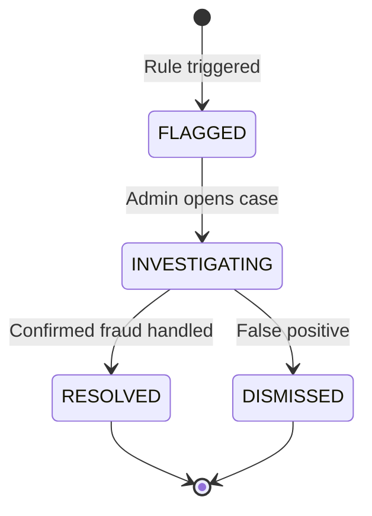

# 7. Fraud Detection System

## 7.1 Overview

HiveTrace monitors QR scan events in real time to identify patterns consistent with counterfeiting, QR cloning, or geographic misrepresentation. When rules trigger, **FraudAlert** records are created for admin investigation.

The system is **rule-based** (deterministic heuristics) rather than machine-learning based — appropriate for a final-year project where explainability during viva defence is essential.

## 7.2 Architecture

```mermaid
flowchart TD
    Scan[QR Scan Event] --> Register[registerScan / registerScanByHash]
    Register --> Log[Create QRScan record]
    Log --> Increment[Increment scan counters]
    Increment --> Checks[runFraudChecks]
    Checks --> T1{Impossible Travel?}
    Checks --> T2{Geo Mismatch?}
    Checks --> T3{Scan Burst?}
    T1 -->|Yes| Alert[createFraudAlertIfNew]
    T2 -->|Yes| Alert
    T3 -->|Yes| Alert
    Alert --> DB[(FraudAlert table)]
    DB --> Admin[/admin/fraud panel]
```

Source: `lib/actions/scan-actions.ts`

## 7.3 Scan Data Collection

Each scan records:

| Field | Source |
|-------|--------|
| `latitude`, `longitude` | Browser geolocation API or Vercel geo headers |
| `country`, `city` | Client data or `x-vercel-ip-country` / `x-vercel-ip-city` |
| `ipAddress` | `x-forwarded-for` header |
| `timestamp` | Server time at insert |
| `userAgent` | Available via headers (optional) |

Scan registration paths:

1. **`registerScan(qrCodeId, locationData)`** — Primary path with full fraud checks
2. **`registerScanByHash(hash, locationData)`** — Resolves batch from hash, then delegates to `registerScan`
3. **`POST /api/qr/verify`** — Legacy API route; logs scans but does not run full fraud engine (notable integration gap)

## 7.4 Detection Rules

### Rule 1: Impossible Travel

**Type:** `IMPOSSIBLE_TRAVEL`  
**Severity:** HIGH

If the same QR code is scanned in **two different countries within 24 hours**, an alert is raised. This indicates likely QR code duplication — a physical label copied and distributed in multiple regions.

```typescript
const suspiciousTravel = recentScans.filter(
  (s) => s.country !== 'Unknown' &&
         location.country !== 'Unknown' &&
         s.country !== location.country
);
```

### Rule 2: Geographic Mismatch

**Type:** `GEO_MISMATCH`  
**Severity:** MEDIUM  
**Requires:** `NEXT_PUBLIC_ENABLE_GEO_VERIFICATION=true`

If scan GPS coordinates exceed **50 km** from the producer's registered apiary coordinates (Haversine distance), an alert is created.

Threshold configured in `lib/config.ts`:

```typescript
fraud: {
  geoThresholdKm: 50,
}
```

This rule assumes producer latitude/longitude are set in their profile settings.

### Rule 3: Scan Burst (Duplicate QR)

**Type:** `DUPLICATE_QR`  
**Severity:** HIGH

If more than **5 scans** occur on the same QR code within **1 minute**, an alert fires. Legitimate consumer scans are typically single events; bursts suggest automated scanning or widespread label duplication.

Threshold: `config.fraud.duplicateQrThreshold = 5`

## 7.5 Alert Deduplication

`createFraudAlertIfNew()` prevents alert spam:

- Same `batchId` + `type` combination
- Status in `FLAGGED`, `PENDING`, or `INVESTIGATING`
- Created within the last **24 hours**

If a matching alert exists, no duplicate is created.

## 7.6 Consumer-Reported Discrepancies

Consumers can report issues from the verification page via `reportBatchDiscrepancy()`:

- **Type:** `SUSPICIOUS_ACTIVITY`
- **Severity:** MEDIUM
- Stores reason text and hash evidence as JSON

This provides a human-in-the-loop signal complementing automated rules.

## 7.7 Alert Lifecycle



Managed via `updateFraudAlertStatus()` in `admin-actions.ts` and the fraud alerts panel (`components/admin/fraud-alerts-panel.tsx`).

| Status | Meaning |
|--------|---------|
| `FLAGGED` | New alert awaiting review |
| `INVESTIGATING` | Admin actively reviewing |
| `RESOLVED` | Issue confirmed and addressed |
| `DISMISSED` | False positive, no action needed |

## 7.8 Admin Dashboard Integration

The admin home page (`/admin`) displays:

- Count of active fraud alerts
- Recent alert summaries
- Weekly scan trend statistics

The dedicated fraud page (`/admin/fraud`) provides filtering and status update controls.

## 7.9 Feature Flags

Fraud detection can be toggled via environment variables:

```
NEXT_PUBLIC_ENABLE_FRAUD_DETECTION=true
NEXT_PUBLIC_ENABLE_GEO_VERIFICATION=true
```

When disabled, scan logging continues but geo checks are skipped.

## 7.10 Limitations

| Limitation | Impact | Mitigation Path |
|------------|--------|-----------------|
| IP geolocation accuracy | City/country may be wrong | Prefer browser GPS with user consent |
| VPN usage | False geo-mismatch alerts | Whitelist or reduce severity |
| Shared QR in marketing | Legitimate burst scans | Raise threshold or time window |
| No ML anomaly detection | Novel fraud patterns missed | Future: train on scan feature vectors |

## 7.11 Demonstration Scenarios

See [Testing & Demonstration](./13-testing-demonstration.md) for step-by-step fraud trigger scenarios.

## 7.12 Related Documents

- [Cryptographic Verification](./05-cryptographic-verification.md)
- [Blockchain Ledger](./06-blockchain-ledger.md)
- [Database Design](./11-database-design.md)
