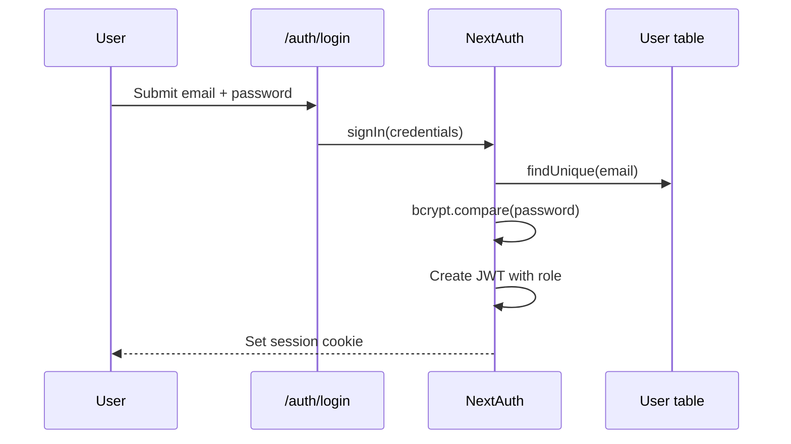

# 8. Authentication & Authorization

## 8.1 Overview

HiveTrace uses **NextAuth.js v5** (Auth.js) with a **Credentials provider** for email/password login. Sessions are stored as **JWTs** (JSON Web Tokens) rather than database sessions, reducing database round-trips on each request.

Role-based access control (RBAC) restricts features to three roles: **CONSUMER**, **PRODUCER**, and **ADMIN**.

## 8.2 Authentication Flow



### Password Storage

Passwords are hashed with **bcryptjs** at registration (`app/api/auth/register/route.ts`) and verified at login:

```typescript
const isPasswordValid = await bcrypt.compare(
  credentials.password,
  user.password
);
```

Plain-text passwords are never stored.

## 8.3 Session Configuration

Source: `lib/auth.ts`, `auth.config.ts`

| Setting | Value |
|---------|-------|
| Strategy | JWT |
| Sign-in page | `/auth/login` |
| Token fields | `id`, `role`, `image` |
| Session propagation | `session.user.id`, `session.user.role` |

JWT callback embeds role on login:

```typescript
async jwt({ token, user }) {
  if (user) {
    token.id = user.id;
    token.role = user.role || "CONSUMER";
  }
  return token;
}
```

## 8.4 Role Definitions

| Role | Database Value | Access |
|------|------------------|--------|
| Consumer | `CONSUMER` | Shop, scanner, orders, reviews, public pages |
| Producer | `PRODUCER` | Dashboard, batch/product management, analytics |
| Admin | `ADMIN` | All producer access + admin portal |

Roles are stored on the `User.role` field in Prisma schema.

## 8.5 Route Protection

### Proxy Middleware

Source: `proxy.ts`

The middleware intercepts requests to protected paths:

| Path Pattern | Requirement |
|--------------|-------------|
| `/auth/*` | Redirect logged-in users to `/dashboard` |
| `/dashboard/*` | Login required; PRODUCER or ADMIN role |
| `/admin/*` | Login required; ADMIN role only |
| `/checkout/*` | Login required |
| `/consumer/orders` | Login required |

Unauthenticated users are redirected to `/auth/login?callbackUrl=...`.

### Server-Side Authorization

Route middleware is the first gate. Server Actions perform **defence in depth** with explicit role checks:

```typescript
const session = await auth();
if (!session?.user || session.user.role !== 'ADMIN') {
  throw new Error('Unauthorized');
}
```

This prevents direct Server Action invocation bypassing UI restrictions.

## 8.6 Authorization Matrix

| Feature | Consumer | Producer | Admin |
|---------|:--------:|:--------:|:-----:|
| Scan QR / verify batch | ✓ | ✓ | ✓ |
| Shop / checkout | ✓ | ✓ | ✓ |
| Producer dashboard | ✗ | ✓ | ✓ |
| Create batches | ✗ | ✓* | ✓ |
| Admin panel | ✗ | ✗ | ✓ |
| Approve producers/batches | ✗ | ✗ | ✓ |
| View fraud alerts | ✗ | ✗ | ✓ |
| View ledger | ✗ | ✗ | ✓ |

\* Producer must be admin-verified (`producer.verified = true`) before batch creation.

## 8.7 Registration

Route: `POST /api/auth/register`

Creates a `User` record with bcrypt-hashed password. Producers additionally receive a `Producer` profile in `PENDING` status awaiting admin approval.

Default role assignment:

- Registration form selects role (Consumer or Producer)
- Admin accounts created via seed script only

## 8.8 Security Considerations

| Concern | Implementation |
|---------|----------------|
| Session secret | `AUTH_SECRET` / `NEXTAUTH_SECRET` environment variable |
| CSRF | NextAuth built-in CSRF protection on auth routes |
| Password strength | Configurable minimums in `lib/config.ts` |
| Direct API access | All mutation endpoints check session |
| Role escalation | Role stored server-side in JWT; not client-modifiable |

## 8.9 Session Usage in Components

Server Components and Actions:

```typescript
import { auth } from '@/lib/auth';

const session = await auth();
if (!session?.user?.id) throw new Error('Unauthorized');
```

Client Components requiring session use NextAuth React hooks where applicable.

## 8.10 Related Documents

- [System Architecture](./02-system-architecture.md)
- [API Reference](./12-api-reference.md)
- [Testing & Demonstration](./13-testing-demonstration.md)
