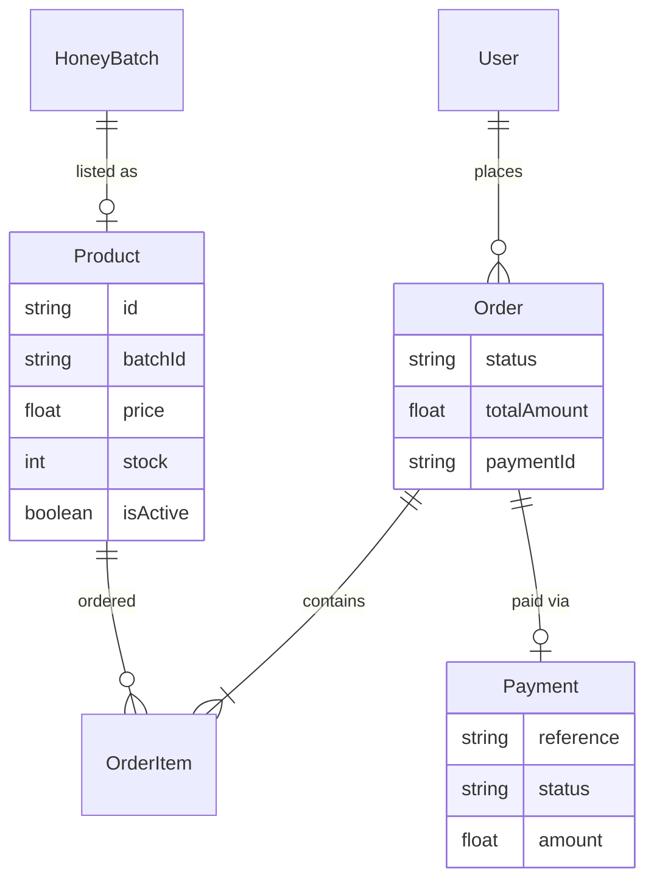
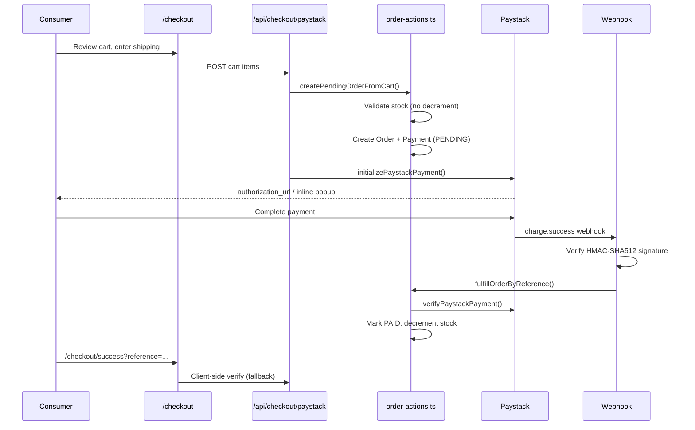

# 9. E-Commerce & Payments

## 9.1 Overview

HiveTrace integrates a lightweight e-commerce layer allowing consumers to purchase honey products linked to verified batches. Payments are processed through **Paystack**, a payment gateway popular in African markets.

The commerce module connects traceability to commercial trust: consumers who complete purchases can leave **verified reviews**.

## 9.2 Commerce Data Model



- Each **Product** links 1:1 to a **HoneyBatch**
- **Orders** belong to consumers; **OrderItems** snapshot price at purchase time
- **Payment** records track Paystack reference and status independently

## 9.3 Order Status Lifecycle

| Status | Meaning |
|--------|---------|
| `PENDING` | Order created, awaiting payment |
| `PAID` | Paystack verification succeeded |
| `FAILED` | Payment verification failed |
| `SHIPPED` | Producer marked as shipped (manual update) |
| `DELIVERED` | Order fulfilled |

Stock decrement occurs **only** on transition to `PAID`.

## 9.4 Checkout Flow



## 9.5 Key Implementation Files

| File | Responsibility |
|------|----------------|
| `lib/paystack-server.ts` | Server-side Paystack API calls |
| `lib/paystack.ts` | Client-side popup integration |
| `lib/actions/order-actions.ts` | Order creation, fulfillment, retry |
| `app/api/checkout/paystack/route.ts` | Initialize checkout |
| `app/api/checkout/paystack/verify/route.ts` | Client verification endpoint |
| `app/api/checkout/paystack/webhook/route.ts` | Server webhook handler |
| `app/api/checkout/paystack/retry/route.ts` | Retry pending payment |

## 9.6 Payment Initialization

```typescript
export async function initializePaystackPayment(params: {
  email: string;
  amount: number;      // In major currency units (e.g. GHS)
  reference: string;
  metadata?: Record<string, unknown>;
}) {
  // Amount sent to Paystack in pesewas/kobo (× 100)
  amount: Math.round(params.amount * 100),
  currency: 'GHS',
  callback_url: `${baseUrl}/checkout/success`,
}
```

Payment references follow the pattern: `HT-{timestamp}-{random}`

## 9.7 Payment Verification

Dual verification paths ensure reliability:

### Webhook (Primary)

Paystack sends `charge.success` events to `/api/checkout/paystack/webhook`.

Signature validation:

```typescript
const hash = crypto
  .createHmac('sha512', secret)
  .update(rawBody)
  .digest('hex');

if (hash !== signature) {
  return 401; // Invalid signature
}
```

### Client Callback (Fallback)

The success page calls `/api/checkout/paystack/verify?reference=...` if webhook delivery is delayed (common in local development).

### Verification Checks

`fulfillOrderByReference()` validates:

1. Payment record exists
2. Paystack API returns `status: success`
3. Paid amount matches order total (in minor units)
4. Product stock is sufficient before decrement

## 9.8 Pending Payment Retry

Consumers with `PENDING` orders see a retry button on `/consumer/orders`.

`retryOrderPayment(orderId)`:

1. Validates order belongs to current user
2. Reuses existing payment reference or creates new Payment record
3. Re-initializes Paystack transaction
4. Returns authorization URL for popup

Component: `components/consumer/retry-payment-button.tsx`

## 9.9 Producer Order Management

Producers view orders containing their products at `/dashboard/orders` via `getProducerOrders()`.

`updateOrderStatus()` allows producers to mark orders as shipped/delivered (status string update with producer authorization check).

## 9.10 Analytics Integration

Revenue analytics (`lib/actions/analytics-actions.ts`) aggregate from **paid orders only**:

```typescript
const orders = await prisma.order.findMany({
  where: {
    status: 'PAID',
    items: { some: { product: { producerId: producer.id } } },
  },
});
```

This replaces earlier placeholder random revenue data.

## 9.11 Paystack Test Mode

For demonstration, use Paystack test keys in `.env`:

```
PAYSTACK_SECRET_KEY=sk_test_...
NEXT_PUBLIC_PAYSTACK_PUBLIC_KEY=pk_test_...
```

Test card: `5061 0000 0000 0000 008`  
PIN: `1234`, OTP: `123456`

## 9.12 Security Notes

| Risk | Mitigation |
|------|------------|
| Webhook spoofing | HMAC-SHA512 signature required |
| Amount tampering | Server verifies Paystack amount vs order total |
| Double fulfillment | Idempotent check: skip if already PAID |
| Client-side trust | Never mark paid based on client callback alone without API verify |

**Important:** Rotate Paystack secret keys if exposed. Never commit live keys to version control.

## 9.13 Related Documents

- [Reputation & Reviews](./10-reputation-reviews.md)
- [Technology Stack](./04-technology-stack.md)
- [Testing & Demonstration](./13-testing-demonstration.md)
