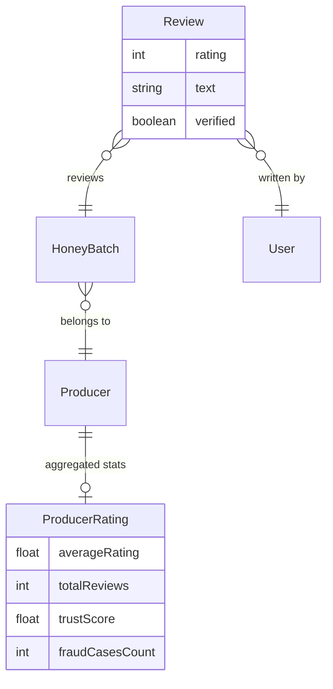

# 10. Reputation & Reviews

## 10.1 Overview

HiveTrace implements a **batch-level review system** with producer-level reputation aggregation. Reviews serve as a social trust signal complementing cryptographic and ledger-based verification.

A key design decision: reviews from consumers who **completed a paid purchase** receive a **verified badge**, distinguishing authentic buyer feedback from anonymous ratings.

## 10.2 Data Model



### Review Constraints

- One review per user per batch (enforced in `submitBatchReview`)
- Rating range: 1–5 stars
- Review text required (non-empty)

## 10.3 Verified Purchase Logic

Source: `lib/actions/review-actions.ts`

When a consumer submits a review:

```typescript
let verified = false;
if (batch.product) {
  const paidOrder = await prisma.order.findFirst({
    where: {
      consumerId: session.user.id,
      status: 'PAID',
      items: { some: { productId: batch.product.id } },
    },
  });
  verified = !!paidOrder;
}
```

| Condition | Verified Badge |
|-----------|:--------------:|
| Paid order exists for batch's product | ✓ |
| No purchase or order pending/failed | ✗ |
| Batch has no linked product | ✗ |

This creates a closed trust loop: **Traceability → Purchase → Verified Feedback → Producer Reputation**.

## 10.4 Rating Aggregation

After each review submission, `updateProducerRating()` recalculates:

```typescript
const averageRating = totalReviews > 0
  ? reviews.reduce((sum, r) => sum + r.rating, 0) / totalReviews
  : 0;

await prisma.producerRating.upsert({
  where: { producerId },
  update: { averageRating, totalReviews },
  create: { producerId, averageRating, totalReviews, trustScore: 100 },
});
```

### ProducerRating Fields

| Field | Purpose |
|-------|---------|
| `averageRating` | Mean of all batch review ratings |
| `totalReviews` | Count of reviews across all batches |
| `trustScore` | 0–100 composite score (initialized at 100 on approval) |
| `fraudCasesCount` | Reserved for fraud impact on trust (future use) |

## 10.5 Display Surfaces

| Page | Data Shown |
|------|------------|
| `/consumer/batch/[id]` | Batch reviews, avg rating, submit form |
| `/consumer/producer/[id]` | Producer profile, recent reviews, batch list |
| `/dashboard/reviews` | Producer's received reviews and stats |
| `/verify/[hash]` | Producer rating summary on verification page |
| `/shop` | Product listings with producer ratings |

## 10.6 Producer Review Dashboard

Route: `/dashboard/reviews`

Server action: `getDashboardReviews()`

Returns:

- List of reviews across all producer batches
- Statistics: average rating, total count, 5-star percentage, this month's count

Statistics computed in `getProducerReviewStats()`:

```typescript
{
  averageRating,
  totalReviews,
  fiveStarCount,
  fiveStarPercent,
  thisMonthCount,
}
```

## 10.7 Feature Flag

Reviews can be disabled platform-wide:

```
NEXT_PUBLIC_ENABLE_REVIEWS=true
```

Checked in `lib/config.ts` → `features.reviews`.

## 10.8 API Endpoint

```
POST /api/reviews
```

Requires authenticated session. Delegates to `submitBatchReview` with request body validation.

```
GET /api/reviews?batchId=xxx
```

Returns reviews for a specific batch (public read).

## 10.9 Trust Score Concept

`trustScore` (default 100) is designed as a composite metric incorporating:

- Review average (implemented)
- Fraud case count (schema ready, auto-adjustment not implemented)
- Admin verification status (producer.verified)

Future work could reduce trust score when fraud alerts are confirmed against a producer.

## 10.10 Academic Significance

The verified review mechanism demonstrates **multi-layer trust architecture**:

1. **Technical trust** — HMAC hash proves data integrity
2. **Institutional trust** — Admin verification + ledger registration
3. **Social trust** — Verified consumer reviews

This layered model is defensible in academic literature on food traceability systems.

## 10.11 Related Documents

- [E-Commerce & Payments](./09-ecommerce-payments.md)
- [Database Design](./11-database-design.md)
- [Testing & Demonstration](./13-testing-demonstration.md)
