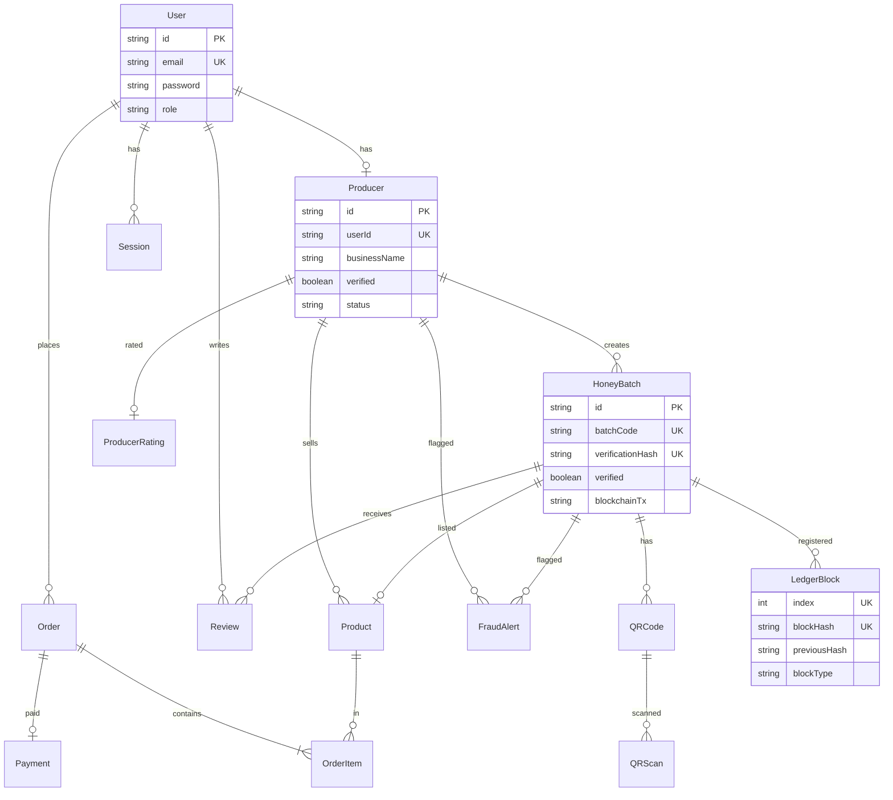

# 11. Database Design

## 11.1 Overview

HiveTrace uses a **relational database** model managed by **Prisma ORM**. The schema in `prisma/schema.prisma` defines 15 entities organised into four logical domains:

1. **Identity** — Users, Sessions
2. **Traceability** — Producers, Batches, QR Codes, Scans, Ledger
3. **Trust & Safety** — Reviews, Ratings, Fraud Alerts
4. **Commerce** — Products, Orders, Payments

Local development uses **SQLite** (`file:./dev.db`). The schema is portable to PostgreSQL for production.

## 11.2 Entity Relationship Diagram



## 11.3 Core Entities

### User

Central identity record for all roles.

| Field | Type | Notes |
|-------|------|-------|
| `id` | cuid | Primary key |
| `email` | string | Unique login identifier |
| `password` | string | bcrypt hash |
| `role` | string | CONSUMER, PRODUCER, ADMIN |

### Producer

Extended profile for beekeepers. One-to-one with User.

| Field | Type | Notes |
|-------|------|-------|
| `verificationHash` | string | Producer-level HMAC (unique) |
| `verified` | boolean | Admin approval flag |
| `status` | string | PENDING, APPROVED, REJECTED |
| `latitude`, `longitude` | float | Apiary coordinates for geo-fraud |

### HoneyBatch

Central traceability entity.

| Field | Type | Notes |
|-------|------|-------|
| `batchCode` | string | Human-readable ID (HT-YYYY-XXX-###) |
| `verificationHash` | string | HMAC-SHA256 of batch data |
| `verified` | boolean | Admin approved |
| `blockchainTx` | string | Ledger block hash reference |
| `scanCount` | int | Denormalised scan counter |

### LedgerBlock

Append-only audit chain.

| Field | Type | Notes |
|-------|------|-------|
| `index` | int | Sequential block number (unique) |
| `blockHash` | string | SHA-256 of block contents |
| `previousHash` | string | Link to prior block |
| `payload` | string | Canonical JSON event data |
| `blockType` | string | GENESIS, BATCH_VERIFY, FRAUD_RECORD |

## 11.4 Traceability Entities

### QRCode

One or more QR codes per batch. Code field stores JSON payload string.

### QRScan

Individual scan events with geolocation telemetry. Indexed by `qrCodeId` and `timestamp` for fraud queries.

## 11.5 Trust Entities

### Review

Batch-level consumer feedback with optional verified flag.

### ProducerRating

Denormalised aggregate for fast reads on profiles and shop listings.

### FraudAlert

Suspicious activity records with investigation workflow status.

## 11.6 Commerce Entities

### Product

Links a verified batch to a sellable SKU with price and stock.

### Order / OrderItem

Order header with status; items snapshot `priceAtPurchase` to preserve historical pricing.

### Payment

Paystack reference tracking separate from order for payment retry scenarios.

## 11.7 Indexing Strategy

Prisma schema includes indexes on frequently queried fields:

| Table | Indexed Fields |
|-------|----------------|
| User | email |
| Producer | userId, verified, status |
| HoneyBatch | producerId, verified, harvestDate |
| QRCode | batchId, code |
| QRScan | qrCodeId, timestamp |
| FraudAlert | status, type, severity, batchId |
| Order | consumerId, status |
| LedgerBlock | index, batchId, blockType |

## 11.8 Seed Data

`prisma/seed.ts` populates demonstration data:

- Admin, producer, and consumer accounts
- Sample batches with verification hashes
- Ledger genesis and batch verification blocks
- Products linked to verified batches
- Sample reviews and fraud alerts

Run with:

```bash
pnpm db:seed
```

## 11.9 Migration Commands

```bash
# Apply schema to database (development)
pnpm exec prisma db push

# Generate Prisma client after schema changes
pnpm exec prisma generate

# Open visual database browser
pnpm exec prisma studio
```

## 11.10 Data Integrity Rules

| Rule | Enforcement |
|------|-------------|
| One review per user per batch | Application check in submitBatchReview |
| One product per batch | `@unique` on Product.batchId |
| One payment per order | `@unique` on Payment.orderId |
| Ledger block sequence | Application logic in blockchain.ts |
| Cascade deletes | User deletion cascades to Producer, Sessions |

## 11.11 Related Documents

- [Cryptographic Verification](./05-cryptographic-verification.md)
- [Blockchain Ledger](./06-blockchain-ledger.md)
- [Technology Stack](./04-technology-stack.md)
